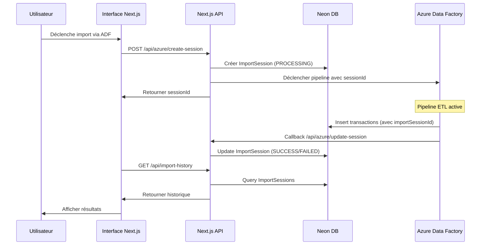

# 🔄 Guide d'Intégration Azure ETL avec T-Report

## 📋 Vue d'ensemble

Ce document présente une analyse et des recommandations pour intégrer Azure Data Factory (ADF) dans votre application T-Report afin d'améliorer le processus d'import et de traitement des données CSV.

---

## 🎯 Situation Actuelle

### Architecture existante
Votre application utilise actuellement un système d'import CSV local avec les caractéristiques suivantes :

- **Backend** : Next.js API Routes (`/api/upload-csv-*`)
- **Base de données** : Neon PostgreSQL (migration récente)
- **Processus ETL actuel** :
  - Upload via interface web
  - Stream processing en mémoire (papaparse, csv-parse)
  - Validation et transformation dans l'API
  - Insertion batch via Prisma ORM
  - Limites actuelles : 500MB-2GB, 2-10 millions de lignes

### Endpoints d'import actuels
```
/api/upload-csv           : Import simple
/api/upload-csv-stream    : Import en streaming (BATCH_SIZE: 1000)
/api/upload-csv-ultra     : Import ultra-optimisé (BATCH_SIZE: 10000)
/api/upload-csv-flexible  : Import avec détection automatique de format
/api/upload-csv-progress  : Import avec suivi de progression
```

### Avantages du système actuel
✅ **Pas de dépendance externe** : tout fonctionne dans votre application
✅ **Contrôle total** : gestion complète du cycle de vie
✅ **Coûts** : pas de frais de cloud additionnels
✅ **Simplicité** : déploiement direct sur Vercel
✅ **Performance correcte** : jusqu'à 10k transactions par batch

### Limitations actuelles
⚠️ **Goulots d'étranglement** : temps de réponse Next.js limité
⚠️ **Pas de scalabilité horizontale** : traitement séquentiel
⚠️ **Pas de pipeline asynchrone** : tout en temps réel
⚠️ **Gestion d'erreurs limitée** : retry manuel
⚠️ **Pas de monitoring avancé** : logs console uniquement

---

## 🏗️ Proposition : Architecture Hybrid avec Azure Data Factory

### Option 1 : Migration Complète vers ADF (Recommandé pour gros volumes)

```
┌─────────────────┐
│   Sources CSV   │
│  (FTP, Blob,    │
│   SharePoint)   │
└────────┬────────┘
         │
         ▼
┌─────────────────────────────────────┐
│    Azure Data Factory Pipeline     │
│  ┌───────────────────────────────┐ │
│  │  1. Extract                   │ │
│  │     - Lire depuis multiple    │ │
│  │       sources                 │ │
│  │     - Validation format       │ │
│  └──────────────┬────────────────┘ │
│                 │                   │
│  ┌──────────────▼────────────────┘ │
│  │  2. Transform                 │ │
│  │     - Nettoyage données       │ │
│  │     - Conversion types        │ │
│  │     - Enrichissement          │ │
│  │     - Gestion doublons        │ │
│  └──────────────┬────────────────┘ │
│                 │                   │
│  ┌──────────────▼────────────────┘ │
│  │  3. Load                      │ │
│  │     - Insertion batch Neon DB │ │
│  │     - Logging métadonnées     │ │
│  └───────────────────────────────┘ │
└─────────────────────────────────────┘
         │
         ▼
┌─────────────────┐
│   Neon DB       │
│  (PostgreSQL)   │
└─────────────────┘
         │
         ▼
┌─────────────────┐
│  Next.js App    │
│   (Reporting)   │
└─────────────────┘
```

**Avantages** :
- ✅ Traitement de fichiers très volumineux (>10GB)
- ✅ Scalabilité automatique
- ✅ Monitoring intégré (Azure Monitor)
- ✅ Planification automatique (cron)
- ✅ Gestion de plusieurs sources simultanées
- ✅ Transformation complexe sans impact sur l'app
- ✅ Retry automatique et résilience

**Coûts estimés** :
- **Azure Data Factory** : ~$0.025 par heure d'exécution
- **Pipeline actif** : ~$0.001 par activité
- **Stockage Blob** : ~$0.0184/GB/mois
- **Total mensuel estimé** (10 pipelines/jour) : ~$50-100

---

### Option 2 : Architecture Hybride (Recommandé pour démarrer)

Conserver l'import via interface web pour les petits fichiers et utiliser ADF pour les imports volumineux/automatisés.

```
┌─────────────────────────────────────────────────────────┐
│                       T-REPORT                           │
│                                                           │
│  ┌────────────────────┐      ┌─────────────────────┐   │
│  │   Interface Web    │      │  Azure Data Factory │   │
│  │                    │      │                     │   │
│  │  Fichiers < 2GB    │      │  Fichiers > 2GB     │   │
│  │  Import manuel     │      │  Import automatique │   │
│  │  API Next.js       │      │  Pipeline ADF       │   │
│  └────────┬───────────┘      └──────────┬──────────┘   │
│           │                              │               │
│           └──────────────┬───────────────┘               │
│                          ▼                                │
│              ┌───────────────────────┐                  │
│              │    Neon PostgreSQL     │                  │
│              │   (Base de données)    │                  │
│              └───────────────────────┘                  │
└───────────────────────────────────────────────────────────┘
```

**Avantages** :
- ✅ Flexibilité : choix du canal selon le contexte
- ✅ Migration progressive possible
- ✅ Coûts optimisés (ADF uniquement si nécessaire)
- ✅ Interface web reste disponible
- ✅ Automatisation possible pour batch nocturnes

---

## 📊 Comparaison Détaillée

| Critère | Système Actuel | Azure Data Factory | Architecture Hybride |
|---------|---------------|-------------------|---------------------|
| **Volume max** | 2-10M lignes | Illimité | Illimité |
| **Fichier max** | 2GB | >100GB | Flexible |
| **Performance** | Bon (10k/batch) | Excellent | Optimale |
| **Scalabilité** | Verticale | Horizontale | Les deux |
| **Planification** | Manuel | Automatique | Hybride |
| **Monitoring** | Basique | Avancé | Avancé |
| **Coûts** | 0$ | 50-200$/mois | 30-100$/mois |
| **Complexité** | Simple | Moyenne | Moyenne |
| **Temps setup** | 0h | 2-4h | 3-5h |

---

## 🛠️ Implémentation Recommandée

### Phase 1 : Préparation (1-2 semaines)
1. **Analyser vos besoins réels**
   - Volume moyen de données par import
   - Fréquence des imports
   - Taille des fichiers courants
   - Budget mensuel acceptable

2. **Créer un compte Azure**
   - Essai gratuit : $200 de crédits pour 30 jours
   - Abonnement pay-as-you-go

3. **Projet pilote ADF**
   - Créer un resource group Azure
   - Déployer une Data Factory
   - Tester un pipeline simple avec un fichier CSV

### Phase 2 : Développement (2-3 semaines)
1. **Créer les pipelines ADF**
   ```
   Pipelines nécessaires :
   ├── csv-import-standard     (format standard)
   ├── csv-import-flexible     (format variable)
   ├── import-from-blob        (Azure Blob Storage)
   ├── import-from-ftp         (FTP)
   └── notification-webhook    (notifier Next.js)
   ```

2. **Connecter à Neon PostgreSQL**
   - Créer un Linked Service dans ADF
   - Configurer l'authentification
   - Tester la connexion

3. **Implémenter la logique métier**
   - Validation des données
   - Transformation des champs
   - Gestion des doublons
   - Enrichissement (calculs de commissions)

### Phase 3 : Intégration (1 semaine)
1. **Créer une API ADF Next.js**
   ```typescript
   // Nouvel endpoint : /api/azure/trigger-pipeline
   - Recevoir la demande d'import
   - Déclencher le pipeline ADF
   - Retourner un job ID
   ```

2. **Système de notifications**
   ```
   ADF → Azure Function/Logic App → Webhook Next.js → Notification utilisateur
   ```

3. **Dashboard de monitoring**
   - Statut des pipelines
   - Métriques de performance
   - Historique des imports

### Phase 4 : Tests et Déploiement (1 semaine)
1. Tests avec données réelles
2. Tests de charge
3. Documentation
4. Formation utilisateurs

---

## 💰 Estimation des Coûts

### Scénario 1 : Usage modéré
- **2 imports quotidiens** (fichiers < 1GB)
- **Pipeline runtime** : 30 min/jour
- **Coûts** :
  - ADF : ~$15/mois
  - Blob Storage (100GB) : ~$2/mois
  - Data Transfer : ~$5/mois
  - **Total** : ~$22/mois

### Scénario 2 : Usage intensif
- **10 imports quotidiens** (fichiers 1-10GB)
- **Pipeline runtime** : 3h/jour
- **Coûts** :
  - ADF : ~$60/mois
  - Blob Storage (1TB) : ~$20/mois
  - Data Transfer : ~$30/mois
  - **Total** : ~$110/mois

### Optimisations de coûts
1. **Pipeline optimisation** : utiliser l'activité "For Each" efficacement
2. **Auto-pause** : arrêter ADF quand inutilisé
3. **Data Lifecycle Management** : supprimer fichiers anciens automatiquement
4. **Réservation** : si volume constant, payer à l'avance (-30%)

---

## 🚨 Points d'Attention

### Avant d'implémenter
1. **Synchronisation DB** : Votre schema Prisma doit être compatible
   - ✅ Vous avez déjà migré vers PostgreSQL (Neon)
   - ✅ Les contraintes uniques sont en place
   - ✅ La structure est prête

2. **Gestion des doublons** : Comment ADF gérera-t-il les transactions déjà présentes ?
   - Solution recommandée : utiliser `@@unique([transactionId, importSessionId])`
   - Implémenter une logique de skip ou upsert dans ADF

3. **Sécurité** :
   - Stocker les credentials dans Azure Key Vault
   - Limiter les accès aux ressources
   - Chiffrement des données en transit

4. **Test de charge** :
   - Tester avec vos plus gros fichiers
   - Valider les performances sous charge
   - Vérifier la cohérence des données

### Risques à surveiller
⚠️ **Lock-in Azure** : Difficulté à migrer vers autre plateforme
⚠️ **Coûts imprévus** : Monitoring nécessaire
⚠️ **Complexité** : Courbe d'apprentissage pour l'équipe
⚠️ **Overkill** : Pour des petits volumes, ADF peut être excessif

---

## ✅ Recommandations Finales

### Quand adopter Azure ETL ?

**✅ OUI si :**
- Vous importez régulièrement des fichiers > 500MB
- Vous avez besoin d'imports automatiques planifiés
- Vous traitez plusieurs sources de données différentes
- Vos imports bloquent l'interface utilisateur
- Vous avez un budget mensuel de $50+

**❌ NON si :**
- Tous vos fichiers sont < 100MB
- Les imports sont occasionnels (< 2/mois)
- Budget limité (< $50/mois)
- Équipe sans expertise Azure
- Système actuel fonctionne parfaitement

### Approche recommandée pour votre cas

Basé sur votre architecture actuelle (Next.js + Neon PostgreSQL), je recommande :

**🎯 Architecture Hybride Progressive**

1. **Court terme (0-3 mois)** : Conserver le système actuel
   - Optimiser les endpoints existants
   - Améliorer le monitoring côté Next.js
   - Corriger les bugs de synchronisation avec Neon

2. **Moyen terme (3-6 mois)** : Projet pilote ADF
   - Créer un pipeline ADF de test
   - Tester avec des imports automatiques nocturnes
   - Comparer les performances et coûts

3. **Long terme (6-12 mois)** : Migration conditionnelle
   - Si le volume augmente → migrer vers ADF complet
   - Si volume stable → garder l'hybride
   - Continuer à optimiser selon les besoins

---

## 📚 Ressources Utiles

### Documentation Azure
- [Azure Data Factory Docs](https://docs.microsoft.com/azure/data-factory/)
- [ADF Pricing Calculator](https://azure.microsoft.com/pricing/details/data-factory/)
- [PostgreSQL Connector](https://docs.microsoft.com/azure/data-factory/connector-azure-postgresql-database)

### Tutoriels
- [ADF Quickstart](https://learn.microsoft.com/azure/data-factory/quickstart-create-data-factory-portal)
- [CSV to Database Pipeline](https://learn.microsoft.com/azure/data-factory/tutorial-bulk-copy-portal)
- [Cost Optimization Guide](https://learn.microsoft.com/azure/data-factory/concepts-cost-optimization)

### Outils
- [Azure Cost Calculator](https://azure.microsoft.com/pricing/calculator/)
- [ADF Monitoring Dashboard](https://portal.azure.com)

---

## 🤔 Questions à vous Poser

Avant de procéder à toute modification, merci de répondre à ces questions :

1. **Quel est le volume moyen d'un fichier CSV que vous importez ?**
   - [ ] < 100MB
   - [ ] 100MB - 500MB
   - [ ] 500MB - 2GB
   - [ ] > 2GB

2. **À quelle fréquence importez-vous des données ?**
   - [ ] < 1 fois/semaine
   - [ ] 1-3 fois/semaine
   - [ ] 1-2 fois/jour
   - [ ] > 2 fois/jour

3. **Quel est votre budget mensuel pour l'infrastructure ?**
   - [ ] < $50
   - [ ] $50 - $150
   - [ ] $150 - $300
   - [ ] > $300

4. **Avez-vous des problèmes de performance actuellement ?**
   - [ ] Non, tout fonctionne bien
   - [ ] Oui, imports lents
   - [ ] Oui, timeouts fréquents
   - [ ] Oui, interface bloquée pendant imports

5. **Avez-vous besoin d'importer depuis plusieurs sources ?**
   - [ ] Une seule source (interface web)
   - [ ] Plusieurs FTP
   - [ ] Blob Storage
   - [ ] APIs externes

---

## 🔗 Intégration des Sessions d'Import avec Azure Data Factory

### ❓ Problématique

Votre système utilise des **sessions d'import** pour :
1. **Traçabilité** : Chaque import est enregistré avec nom, taille, date
2. **Statistiques** : totalRows, validRows, importedRows, status
3. **Gestion des doublons** : Contrainte unique `@@unique([transactionId, importSessionId])`
4. **Historique** : Interface pour voir tous les imports et possibilité d'annuler
5. **Reporting** : Calcul des commissions par session

**Question** : Comment gérer les sessions d'import quand Azure Data Factory traite les fichiers ?

### ✅ Solutions Proposées

#### Solution 1 : API de Pré-Création de Session (Recommandée)

**Architecture** :
```
┌──────────────────────────────────────────────────────────────┐
│                     FLOW D'IMPORT ADF                        │
└──────────────────────────────────────────────────────────────┘

1. DÉCLENCHEMENT
   │
   ├─> Next.js API reçoit demande d'import
   │
   ├─> Crée ImportSession en DB avec status='PROCESSING'
   │   POST /api/azure/create-session
   │   └─> Retourne { sessionId, fileName, ... }
   │
   └─> Déclenche Pipeline ADF avec sessionId en paramètre

2. PIPELINE ADF
   │
   ├─> Receive sessionId (pipeline parameter)
   │
   ├─> Extract: Lit le fichier CSV
   │
   ├─> Transform: Transforme les données
   │    └─> Ajoute importSessionId à chaque transaction
   │
   └─> Load: Insert dans Neon PostgreSQL
        └─> Utilise constraint unique([transactionId, importSessionId])

3. CALLBACK
   │
   ├─> ADF → Azure Function/Logic App
   │    └─> Webhook vers Next.js
   │
   └─> Next.js met à jour ImportSession
        PUT /api/azure/update-session
        └─> Met à jour status, importedRows, etc.
```

**Implémentation** :

1. **Nouvel endpoint** : `/api/azure/create-session`
```typescript
// src/app/api/azure/create-session/route.ts
export async function POST(request: NextRequest) {
  const { fileName, fileSize, pipelineName } = await request.json();
  
  // Créer la session d'import
  const importSession = await prisma.importSession.create({
    data: {
      fileName,
      fileSize,
      totalRows: 0,
      validRows: 0,
      importedRows: 0,
      status: 'PROCESSING', // Nouveau statut
      errorMessage: null,
    }
  });
  
  // Déclencher le pipeline ADF avec le sessionId
  await triggerAzurePipeline({
    pipelineName,
    parameters: {
      sessionId: importSession.id,
      fileName: fileName
    }
  });
  
  return NextResponse.json({ sessionId: importSession.id });
}
```

2. **Endpoint callback** : `/api/azure/update-session`
```typescript
// src/app/api/azure/update-session/route.ts
export async function PUT(request: NextRequest) {
  const { sessionId, totalRows, importedRows, status, errorMessage } = await request.json();
  
  await prisma.importSession.update({
    where: { id: sessionId },
    data: {
      totalRows,
      importedRows,
      status, // SUCCESS, FAILED, PARTIAL
      errorMessage,
      importedAt: new Date(),
    }
  });
  
  return NextResponse.json({ success: true });
}
```

3. **Modifier le schéma** : Ajouter le statut 'PROCESSING'
```prisma
enum ImportStatus {
  PROCESSING  // Nouveau
  SUCCESS
  FAILED
  PARTIAL
  CANCELLED
}
```

**Avantages** :
- ✅ Sessions créées avant le traitement
- ✅ Traçabilité complète
- ✅ Pas de changement dans l'UI existante
- ✅ Compatible avec l'annulation d'import

---

#### Solution 2 : Webhook ADF avec Meta-Data

**Architecture simplifiée** pour imports complètement automatisés :

```typescript
// ADF Logs les métadonnées dans une table séparée
// puis crée la session après complétion

// Table: pipeline_runs
CREATE TABLE pipeline_runs (
  run_id UUID PRIMARY KEY,
  pipeline_name VARCHAR(255),
  start_time TIMESTAMP,
  end_time TIMESTAMP,
  status VARCHAR(50),
  records_processed INT,
  file_name VARCHAR(500)
);
```

Cette approche nécessite une migration et est moins compatible avec votre système actuel.

---

#### Solution 3 : Traitement ADF sans Session (Non recommandé)

Ne pas créer de sessions pour les imports ADF et gérer uniquement les transactions.

**Avantages** : Plus simple, moins de gestion
**Inconvénients** : 
- ❌ Perte de traçabilité
- ❌ Pas d'annulation par session
- ❌ Statistiques incomplètes
- ❌ Rupture avec le modèle existant

---

### 🎯 Recommandation : Solution 1

Pour votre cas d'usage, je recommande **fortement** la Solution 1 car :

1. ✅ **Compatibilité totale** : L'UI existante fonctionne sans modification
2. ✅ **Traçabilité complète** : Tous les imports (web + ADF) dans le même système
3. ✅ **Annulation possible** : Les imports ADF peuvent être annulés comme les autres
4. ✅ **Statistiques cohérentes** : Metrics unifiées pour tous les imports
5. ✅ **Progression simple** : Migration facile vers ADF sans casser l'existant

### 📝 Workflow Complet



### 🔧 Modifications Nécessaires

#### 1. Base de données
```sql
-- Ajouter le statut PROCESSING
ALTER TYPE "ImportStatus" ADD VALUE 'PROCESSING';
```

#### 2. Nouveaux endpoints
- `POST /api/azure/create-session` - Créer session avant ADF
- `PUT /api/azure/update-session` - Mettre à jour après ADF
- `POST /api/azure/trigger-pipeline` - Déclencher ADF

#### 3. Azure Function
- Webhook handler pour les callbacks ADF
- Gestion des erreurs et retries

#### 4. UI (optionnel)
- Badge "PROCESSING" dans ImportHistoryCard
- Auto-refresh pendant traitement
- Notifications en temps réel

---

## 📞 Prochaines Étapes

**Pour avancer, j'ai besoin de :**

1. ✅ **Réponses aux questions ci-dessus**
2. ✅ **Validation de l'architecture cible** (Hybride vs Complète)
3. ✅ **Accès à un compte Azure** (si vous optez pour ADF)
4. ✅ **Échantillon de vos données** (fichier CSV typique)

**Une fois ces informations obtenues, je pourrai :**
- Créer un plan d'implémentation détaillé
- Développer les pipelines ADF
- Intégrer avec votre application Next.js
- Tester et documenter la solution

---

*Document créé le : 2025-01-02*
*Version : 1.0*
*Projet : T-Report*

